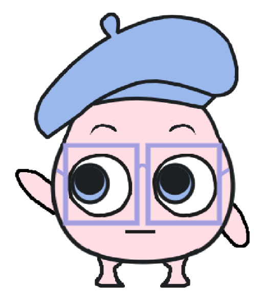
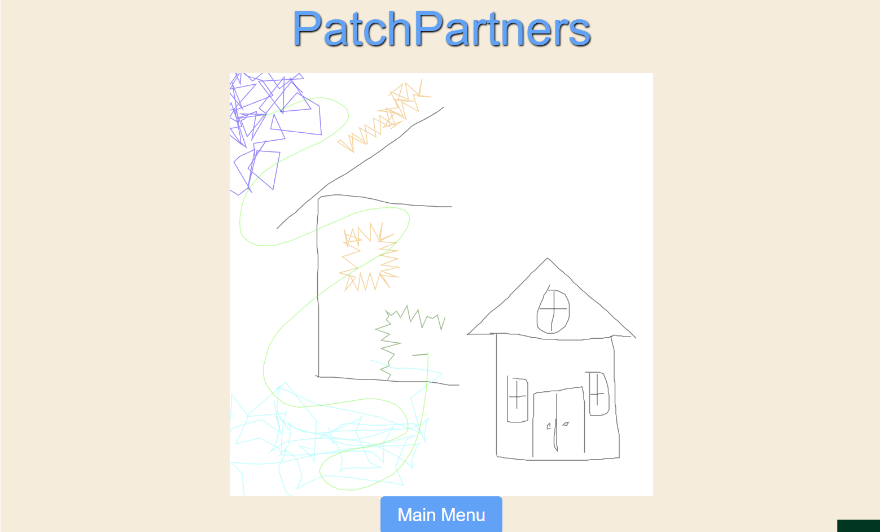

# PatchPartners



A gamified multiplayer embroidery design tool inspired by ["Exquisite Corpse"](https://en.wikipedia.org/wiki/Exquisite_corpse). Two players each draw on their half of a split canvas — without seeing the other's work — until a 2-minute timer runs out. Their drawings are combined and revealed, and the result can be exported as a `.DST` file for physical embroidery machines.

Built during a research project at the [Noyce School of Applied Computing](https://calpoly.edu), Cal Poly SLO (Fall 2024) — advised by Dr. April Grow.

---

## Screenshots

**Drawing screen** — each player sees their half of the canvas; the partner's half is hidden (grey) until the reveal


**Reveal screen** — both halves combined at the end of the round



---

## How It Works

1. **Create or join a room** — one player creates a room and shares the code
2. **Get a prompt** — both players receive a creative prompt and each see only their half of the canvas
3. **Draw for 2 minutes** — use brush tools to create your design; timer is server-authoritative so both players stay in sync
4. **The reveal** — when time's up, both halves merge and display on a shared end screen
5. **Export** — save the combined design as a `.DST` embroidery file loadable onto an embroidery machine

Single-player mode is also available for freeform drawing without a partner or timer.

---

## Brush Tools

### Thick Satin Brush
Creates embroidery-style strokes using a custom satin stitch algorithm. For each segment of a user-drawn path, the brush generates perpendicular zigzag lines tightly packed to simulate real satin stitching.

Two parameters control the output:
- **Thickness** — stroke width (high/low offset = thickness ÷ 2)
- **Frequency** — stitch density (lower = more stitches per unit length)


#### The Happy Accident: Snake Brush
During development, a bug caused zigzag lines to run *parallel* to the path instead of perpendicular — producing an unexpected ribbon effect. Corrected in the final version, but left as a creative curiosity.


---

### Fill Brush
Users trace any freehand outline; on mouse release the shape is auto-closed and filled with parallel stitch lines — the same technique used in machine embroidery fill stitching.

The algorithm: close path → calculate bounding box → generate scan lines → find path intersections → draw stitch lines between each intersection pair.


---

## Tech Stack

| Layer | Technology |
|---|---|
| Drawing & vector math | JavaScript, [Paper.js](http://paperjs.org/) |
| Real-time game state | Firebase Realtime Database |
| Backend / room server | Google Cloud Run |
| Embroidery export | DST file encoding (Tajima format) |

---

## Local Setup

```bash
git clone https://github.com/DerpNPurp/PatchPartners.git
cd PatchPartners

# Serve locally (Python 3)
python3 -m http.server 8080
open http://localhost:8080
```

Multiplayer requires a running backend with Firebase credentials.

---

## Background

Commercial embroidery software is expensive and aimed at professionals. PatchPartners makes it approachable by framing it as a game — no knowledge of stitch counts, thread types, or fabric settings required.

Builds on [agrow/sewsynth](https://github.com/agrow/sewsynth), which provided the initial DST format research, viewer tooling, and canvas foundation. The thick satin brush, fill brush, single-player mode, room system, and UI improvements were built on top of that foundation.

---

## Collaborators

- **Vince Doan** — thick satin brush algorithm, fill brush algorithm, single-player mode, UI/UX fixes
- **Megan Tseng** — game flow, end screen, additional UI work
- **Dr. April Grow** — faculty advisor, Noyce School of Applied Computing, Cal Poly SLO
